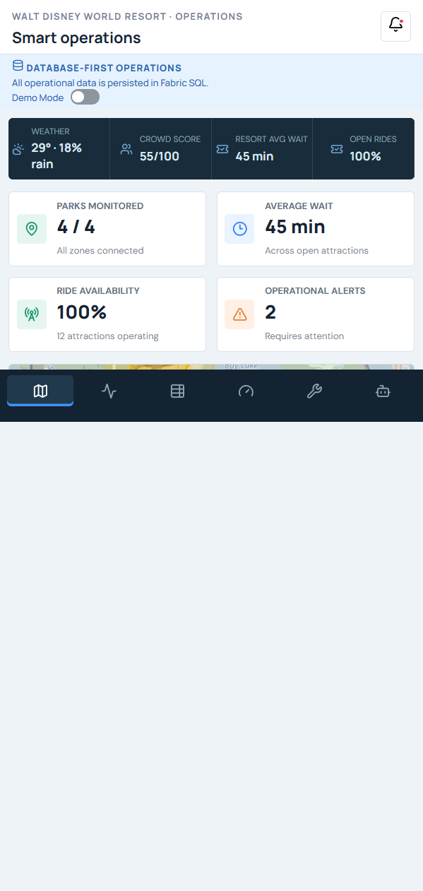
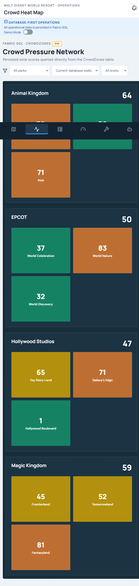
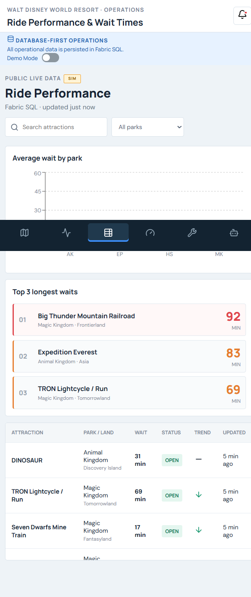
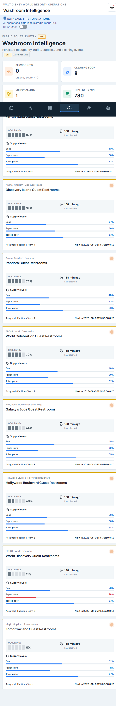
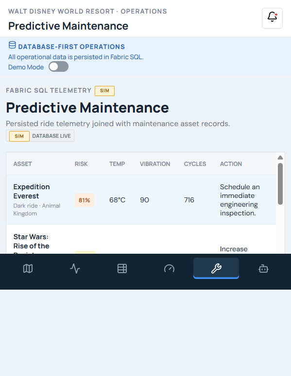
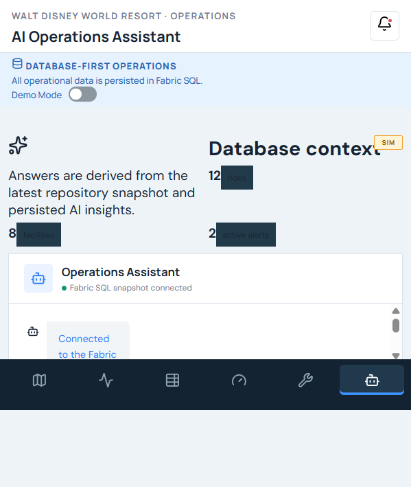
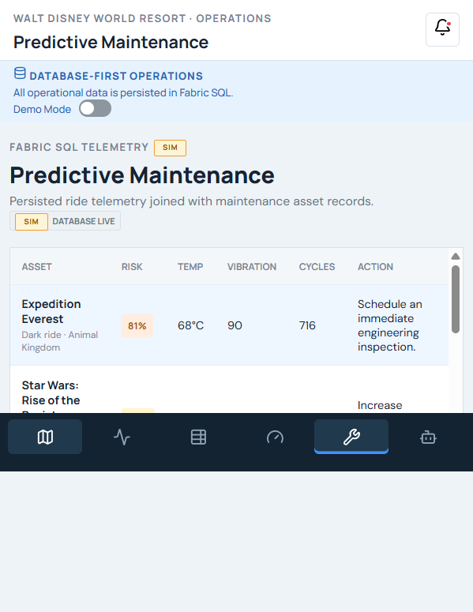

# ParkPulse AI

**AI-Powered Digital Twin Operations Platform built on Microsoft Fabric**

A reusable Fabric App that unifies venue operations, guest flow, facilities intelligence, and predictive maintenance into one action-oriented digital twin experience.

## Project Summary

ParkPulse AI helps large-venue operations teams move from reactive monitoring to proactive decision-making. It brings venue state, guest-flow pressure, facilities telemetry, maintenance risk, and operational recommendations into one Microsoft Fabric App. Walt Disney World provides the synthetic demonstration scenario for the reusable venue-operations pattern below.

The platform pattern applies to:

- Theme parks
- Airports
- Sports stadiums
- Resorts
- Universities
- Smart campuses
- Entertainment venues
- Convention centers

## Problem Statement

Large venues operate as interconnected systems of assets, facilities, guest zones, and specialized teams. A single operating day can involve thousands of changing conditions across guest traffic, equipment status, cleaning demand, weather, supplies, staffing, and maintenance schedules.

The data required to manage those conditions is usually fragmented across traffic systems, facilities applications, computerized maintenance management systems, weather sources, spreadsheets, and disconnected dashboards. Each system may describe one part of the venue, but operators are left to assemble the complete situation manually.

This fragmentation creates four recurring problems:

- Teams react after congestion, cleanliness issues, supply shortages, or equipment downtime have already affected guests.
- Executives lack a unified and current view of operational health, risk, and customer impact.
- Operations, facilities, and maintenance teams work from different priorities and may coordinate too late.
- Field teams receive charts and alerts instead of a ranked list of actions with supporting context.

ParkPulse AI demonstrates how Microsoft Fabric can provide a shared operational data foundation and turn venue telemetry into a digital twin experience. The goal is not another passive dashboard. The goal is to help teams identify pressure earlier, understand the affected venue context, and focus on the next operational action.

## Target Users

### Operations Director

Monitors guest experience and overall venue performance. Needs fast visibility into congestion, attraction or asset status, facility issues, and operational risk across the venue.

### Facilities Manager

Manages cleaning schedules, washrooms, supplies, and guest comfort. Needs demand-aware cleaning and replenishment priorities rather than relying only on fixed schedules.

### Maintenance Manager

Manages asset reliability, preventive maintenance, and work prioritization. Needs early risk signals and supporting telemetry before downtime occurs.

### Executive Leader

Owns operational efficiency, customer satisfaction, and cost control. Needs one view of venue health, major exceptions, and potential business impact.

### Field Team / Frontline Supervisor

Responds to cleaning, maintenance, and crowd-flow tasks. Needs clear, prioritized guidance with location, urgency, and relevant operational context.

## Solution Overview

ParkPulse AI is a reusable digital twin operations platform for complex venues. It organizes venue master data, current operating state, telemetry history, alerts, and operational insights in Fabric SQL, then presents that information through six connected workflows:

1. **Live Resort Digital Twin** provides the primary map-based command center for venue health, guest pressure, waits, facilities, alerts, and recommendations.
2. **Crowd Heat Map** identifies congestion patterns and ranks the venue zones experiencing the most pressure.
3. **Ride Performance and Wait Times** turns attraction status, wait-time, and trend data into operational insights. In other venue types, rides map to gates, rooms, classrooms, concessions, or other service assets.
4. **Washroom Intelligence** demonstrates demand-aware facilities operations using occupancy, traffic, supplies, cleaning urgency, and assignment context.
5. **Predictive Maintenance Dashboard** combines equipment telemetry with maintenance records to rank assets by risk and recommend preventive attention.
6. **AI Operations Assistant** answers supported operational questions from the latest SQL-backed snapshot and persisted insight records, helping a manager decide what to investigate next.

Together, the screens move from venue-wide awareness to domain-specific diagnosis. The digital twin establishes context, analytical screens expose the drivers, and the assistant summarizes the most important current facts.

## Screenshots

### 1. Live Resort Digital Twin



### 2. Crowd Heat Map



### 3. Ride Performance and Wait Times



### 4. Washroom Intelligence



### 5. Predictive Maintenance Dashboard



### 6. AI Operations Assistant



### 7. AI Insight Deep Link Navigation



## Business Value

The application demonstrates qualitative operational outcomes. Any values shown in Demo Mode are simulated and any KPI targets below are illustrative; they are not claims from a customer deployment.

### Guest Experience

- Reduce queue frustration by identifying elevated waits and congestion earlier.
- Improve crowd flow by comparing pressure across venue zones.
- Give operations leaders a shared picture of the issues most likely to affect guests.

### Facilities

- Move from schedule-only cleaning to demand-aware cleaning.
- Improve restroom cleanliness by combining traffic, occupancy, cleaning age, and supply levels.
- Prioritize supply refills and maintenance needs using consistent urgency scoring.

### Maintenance

- Detect elevated asset risk earlier from temperature, vibration, cycles, and downtime events.
- Prioritize preventive work using a common risk view.
- Reduce dependence on purely reactive maintenance processes.

### Leadership

- Unify operational visibility across guest flow, facilities, and physical assets.
- Improve cross-team coordination around the same trusted operational data.
- Support faster decisions with ranked exceptions and supporting evidence.

### Field Teams

- Convert operational signals into clear next actions.
- Reduce alert noise by prioritizing the highest-risk locations and assets.
- Provide the location, assignment, urgency, and telemetry context needed to respond.

## Illustrative KPI Framework

ParkPulse AI does not claim validated customer outcomes. A production pilot should establish a baseline and measure outcomes such as:

| Area | Illustrative KPI | Evidence required in a pilot |
| --- | --- | --- |
| Guest flow | Time spent above a venue-defined congestion threshold | Zone telemetry and intervention timestamps |
| Attraction/service operations | Average wait, availability, and recovery time | Status and wait-time history |
| Facilities | Response time to high cleaning urgency | Alert, assignment, arrival, and completion events |
| Supplies | Number and duration of critical supply conditions | Supply telemetry and refill events |
| Maintenance | Unplanned downtime and mean time to repair | Failure, work-order, and maintenance history |
| Leadership | Time from exception detection to acknowledged action | Alert and audit history |

The demo UI includes current-state indicators such as wait time, availability, crowd pressure, cleaning urgency, supply level, and maintenance risk. These demonstrate how KPIs can be presented, not measured improvements from a live customer.

## Architecture

```text
React screens
  -> Operations and command services
    -> IDataProvider / ITelemetryProvider / IInsightProvider
      -> Entity repositories
        -> Rayfin generated Data API (DAB REST + GraphQL)
          -> Fabric SQL
```

UI components do not contain operational records and do not access Rayfin or SQL directly. `OperationsService` joins repository results into the screen view model. `OperationalCommandService` provides business-level mutations through repositories.

### Fabric SQL Schema

The code-first schema is defined in `rayfin/data/operations.ts` and registered in `rayfin/data/schema.ts`:

- `Parks`
- `Lands`
- `Rides`
- `RideTelemetry`
- `Washrooms`
- `WashroomTelemetry`
- `WeatherSnapshots`
- `CrowdZones`
- `OperationsAlerts`
- `AIInsights`
- `MaintenanceAssets`

Rayfin compiles the entities into Microsoft SQL schema and Data API Builder configuration. `npx rayfin up` applies additive schema migrations and deploys the application. Destructive schema changes require explicit review and `--force`.

### Generated APIs and Repository Layer

Rayfin generates authenticated REST and GraphQL CRUD APIs for every registered entity. Repository classes are the only runtime application code that call the generated data APIs.

Read operations cover venue locations, zones, service assets, facilities, telemetry, weather, alerts, maintenance assets, and insights. The command service defines these business mutations:

| Business command | Repository operation |
| --- | --- |
| Manual maintenance update | `MaintenanceRepository.update` |
| Washroom cleaning event | `WashroomTelemetryRepository.recordCleaning` |
| Ride/asset operational event | `RideRepository.recordOperationalEvent` |
| Alert acknowledgement | `AlertRepository.acknowledge` |

The current Rayfin builder release does not expose a supported custom TypeScript HTTP-functions authoring package. The application therefore implements business commands as a service layer over generated authenticated mutations, without raw runtime SQL or handwritten GraphQL.

## Database Persistence and Seeding

Fabric SQL is the system of record for venue master data, current state, telemetry history, alerts, maintenance state, and persisted insight records.

`DatabaseSeedService.seedIfEmpty()` is an idempotent initialization process. After Fabric authentication is established, it checks `Parks`; only an empty database is initialized. Parent records are created before dependent records through generated APIs.

The initial Walt Disney World demonstration dataset includes four parks, lands, rides, washrooms, crowd zones, maintenance assets, baseline telemetry, weather, an alert, and an operational insight.

If the Fabric Apps Preview generated API worker is unavailable during first deployment, an administrator can run the transactional deployment fallback after `az login`:

```powershell
npm run seed:fabric
```

The fallback uses the current Azure CLI identity to acquire an Entra token for Fabric SQL. It inserts the baseline only when `Parks` is empty, rolls back on failure, and prints operational table counts. No password or access token is stored in the repository.

The checked-in script defaults currently target the demonstration Fabric SQL database. For another environment, invoke it with explicit values:

```powershell
./scripts/seed-fabric-database.ps1 `
  -Server "<fabric-sql-server>.database.fabric.microsoft.com" `
  -Database "<fabric-sql-database>"
```

This script is a deployment bootstrap only. Runtime reads and writes continue to use the service, provider, repository, and generated API layers.

## Demo Mode

The header contains a Demo Mode switch.

- **On:** `DatabaseSimulationService` reads the current database state, calculates illustrative operational changes, and writes ride telemetry, washroom telemetry, crowd scores, park aggregates, maintenance risk, alerts, and insight records.
- **Off:** no synthetic writes occur; screens continue polling SQL and wait for external producers.

Demo Mode is designed for demonstration, not production ingestion. It runs in the authenticated browser session, uses heuristic scoring, and is not backed by Eventstream or a managed worker. Its writes span multiple generated API calls and are not one atomic venue-wide transaction. A production implementation should move ingestion and simulation to managed event processing and add run-level consistency, idempotency, and observability.

## Security Model

### Implemented

- Deployed access uses Fabric brokered SSO with Microsoft Entra ID.
- Generated data APIs require an authenticated session.
- The publishable key is intended for client-side service identification and is not a database credential.
- Direct SQL seeding uses the current administrator's short-lived Entra token.
- Allowed redirect URIs are explicitly configured in `rayfin/rayfin.yml`.

### Current Prototype Boundary

The current entities use authenticated access for all CRUD actions. This is acceptable for a controlled hackathon workspace, but it is not sufficient for a multi-team production deployment.

A production security model should add:

- Role-specific read and mutation permissions for executives, operators, facilities teams, and maintainers.
- Venue or tenant scope on every operational entity.
- Row-level policies using authenticated claims.
- Field-level restrictions for sensitive assignments and maintenance details.
- An immutable audit trail for acknowledgements, dispatches, overrides, and configuration changes.
- Managed identities and least-privilege permissions for ingestion services.

Local development uses a fixed fixture account against the local Rayfin backend. It is not a production credential and should be replaced by environment-specific local test configuration before template distribution.

## Environment Variables

`rayfin env --framework vite` creates `.env.local` from the active Rayfin deployment. The frontend expects:

| Variable | Purpose | Example/source |
| --- | --- | --- |
| `VITE_RAYFIN_API_URL` | Base URL for generated auth and data APIs | Active Rayfin deployment |
| `VITE_RAYFIN_PUBLISHABLE_KEY` | Client-safe Rayfin publishable key | `rayfin/.deployments.json` |
| `VITE_FABRIC_WORKSPACE_ID` | Fabric workspace containing the App Backend | Fabric workspace settings |
| `VITE_FABRIC_ITEM_ID` | Rayfin/Fabric App Backend item ID | Deployment output |
| `VITE_FABRIC_PORTAL_URL` | Fabric portal base URL used for brokered sign-in | Usually `https://app.fabric.microsoft.com` |

Do not commit `.env.local`, access tokens, SQL connection strings, or service secrets.

## Workspace and Identity Requirements

To deploy or operate the demonstration environment:

- Use a Microsoft account in the target Fabric tenant.
- Use a Fabric workspace assigned to supported capacity.
- The deployment identity must be able to create or update the App Backend and associated Fabric SQL resources.
- The SQL seed identity must have permission to connect and insert into the generated application database.
- End users must have access to the Fabric workspace/App Backend and must complete Fabric SSO.
- The live hosting origin must be present in `services.auth.allowedRedirectUris` in `rayfin/rayfin.yml`.

Use least privilege for production. Do not give general operators deployment or direct SQL permissions.

## Local Development and Deployment

### Prerequisites

- Node.js supported by the installed Rayfin CLI
- npm
- Microsoft Fabric access for remote deployment
- Azure CLI only when using the direct SQL seed fallback

### Install, Validate, and Run

```bash
npm install
npm run build
npm run lint
npm run test
npm run dev
```

### Deploy to Microsoft Fabric

```bash
npx rayfin login
npx rayfin login status
npx rayfin up
npm run seed:fabric
npx rayfin up status
```

`npx rayfin up` is the canonical deployment command. It builds the static app, applies the Rayfin data configuration, and deploys to the selected Fabric App Backend.

Fabric SSO is required for deployed data access. The standalone host initiates brokered sign-in; embedded mode receives the Fabric portal session through the supported handoff.

## Test Strategy

The repository currently validates:

- TypeScript compilation and production bundling with `npm run build`.
- ESLint rules with `npm run lint`.
- Authentication provider initialization with Vitest and Testing Library.
- Deployment health with `npx rayfin up status`.
- Seed idempotency and physical row counts through the Fabric SQL seed command.

The current automated suite is intentionally small and does not yet provide production-level coverage. Before template-gallery or production use, add:

- Unit tests for maintenance and cleaning urgency scoring boundaries.
- Repository contract tests for reads, mutations, ordering, and API failures.
- Service tests for snapshot joins, missing related records, and empty states.
- Simulation tests for idempotency, overlap prevention, partial failure, and retry behavior.
- Component tests for every screen, filter, empty state, and business command.
- End-to-end tests for Fabric SSO, seeding, navigation, persistence, and responsive layouts.
- Load tests for telemetry volume, concurrent users, and Fabric capacity sizing.
- Accessibility checks using keyboard navigation and automated WCAG tooling.

## Reusability and Adaptation Guide

The reusable part of ParkPulse AI is the operational pattern:

```text
Venue -> Zones -> Service assets and facilities -> Telemetry
      -> Operational state -> Alerts -> Insights -> Actions
```

The provider interfaces (`IDataProvider`, `ITelemetryProvider`, and `IInsightProvider`) keep screen services separate from the current Fabric SQL implementation. A future provider can source hot telemetry from Eventhouse while retaining Fabric SQL for master data and command state.

### Domain Mapping Examples

| ParkPulse demonstration concept | Airport | Stadium | University / campus | Resort / convention center |
| --- | --- | --- | --- | --- |
| Park | Terminal | Venue/stand | Campus | Property/building |
| Land / crowd zone | Concourse | Gate/section | Building/quad | Wing/hall |
| Ride | Gate/baggage asset | Turnstile/concession | Classroom/shuttle | Elevator/room system |
| Wait time | Security/gate queue | Entry/concession queue | Service/shuttle queue | Check-in/service queue |
| Washroom | Passenger facility | Guest facility | Campus facility | Guest facility |
| Maintenance asset | Jet bridge/conveyor | HVAC/screen/escalator | HVAC/lab/elevator | HVAC/elevator/kitchen asset |

### Adaptation Steps

1. Replace the demonstration seed pack with venue-specific master data and coordinates.
2. Rename UI labels through a domain configuration layer rather than changing repository contracts.
3. Map source systems into the common zone, asset, facility, telemetry, alert, and insight concepts.
4. Configure venue-specific thresholds and scoring policies.
5. Add venue and tenant identifiers plus role-based access policies.
6. Replace browser Demo Mode with Eventstream, pipelines, or managed producers.
7. Connect operational commands to the organization's work-order, dispatch, or communication systems.
8. Establish KPI baselines and validate recommendations against actual outcomes.

The current code demonstrates the pattern but does not yet provide a no-code domain-pack installer. Generalizing entity names, labels, policies, and seed configuration is part of the template roadmap.

## AI and Real-Time Capability Disclosure

Technical credibility matters more than an inflated feature claim. The current implementation has these boundaries:

- The **AI Operations Assistant is not currently backed by a generative model**. It uses deterministic question matching, SQL-backed operational facts, and persisted `AIInsights` to answer a supported set of venue questions.
- The **predictive maintenance score is a transparent heuristic**, not a trained machine-learning failure model. Production use requires historical failures, model validation, explainability, and accuracy monitoring.
- The application is **not currently connected to Fabric Eventstream, Eventhouse, a KQL Database, or Activator**. Demo Mode writes synthetic records through generated APIs from the browser.
- "Live" in the prototype means the latest persisted Fabric SQL state refreshed on a polling interval; it does not mean hard real-time or safety-critical processing.

These boundaries make the demo reproducible while preserving a credible path to model-backed intelligence and Fabric Real-Time Intelligence.

## Future Fabric Real-Time Intelligence Path

Provider interfaces deliberately avoid SQL-specific assumptions. Future adapters can source hot telemetry and insights from Fabric Eventstream, Eventhouse, KQL Database, or OneLake while retaining Fabric SQL for operational master data and command state.

```text
Sensors and source systems
  -> Fabric Eventstream
    -> Eventhouse / KQL Database
      -> ITelemetryProvider
      -> Activator rules -> OperationsAlerts and external notifications

OneLake historical data
  -> model training / analytics
    -> IInsightProvider -> AIInsights

Fabric SQL
  -> IDataProvider for venue master data, workflow, and command state
```

Planned enhancements include:

- Managed telemetry ingestion and stream processing.
- KQL-backed historical trends and anomaly investigation.
- Activator-based alerting and escalation.
- Model-backed maintenance predictions with confidence and explanations.
- A grounded generative assistant with citations and action confirmation.
- Alert policy configuration, work orders, dispatch, acknowledgement, and completion workflows.
- Multi-venue tenancy, role-based authorization, audit history, and operational SLAs.
- Historical playback and incident replay for the digital twin.

## Product Feedback for Fabric Apps and Rayfin

Building ParkPulse AI surfaced actionable product feedback:

1. **Background execution:** browser sessions are not a reliable host for simulation or operational processing. A documented managed-worker or scheduled-function path would improve Fabric App templates.
2. **Transactional commands:** venue workflows often update several aggregates. Generated APIs would benefit from supported transactional business operations or custom server functions.
3. **Generated API diagnostics:** request correlation IDs, latency metrics, worker health, and clearer timeout details would reduce troubleshooting time.
4. **Fabric SSO testing:** a documented automated test strategy for embedded and standalone brokered authentication would improve deployment confidence.
5. **Environment portability:** generated helpers for exporting/importing deployment settings and resolving the attached Fabric SQL endpoint would reduce hardcoded setup.
6. **Latest-per-entity queries:** first-class grouped latest-record patterns would prevent clients from loading complete telemetry history to compute current state.
7. **Relationship integrity:** clearer guidance or generated support for foreign-key constraints would strengthen operational data models.
8. **Template lifecycle:** template metadata, parameter prompts, sample-data packs, screenshots, and post-deploy verification hooks would make gallery submissions more reproducible.

This feedback is based on concrete implementation and deployment work rather than hypothetical product requests.

## Limitations

- The Walt Disney World dataset is synthetic and used only as a recognizable demonstration scenario.
- Disney names and locations do not imply affiliation, endorsement, or access to Disney operational systems.
- The assistant is deterministic rather than model-backed.
- Maintenance and cleaning scores are illustrative heuristics, not validated production models.
- Eventstream, Eventhouse, KQL, Activator, and OneLake integrations are architectural next steps, not current runtime dependencies.
- Browser Demo Mode is non-atomic across its generated API writes and should not be used as a production simulator.
- The current authorization model does not implement venue-level or persona-level least privilege.
- Current repositories load complete entity collections and telemetry history; pagination, latest-row server queries, caching, and virtualization are required for large deployments.
- UUID reference fields are managed by application logic; production data integrity requires stronger relationship enforcement and validation.
- Current business command methods are not yet exposed as complete operator workflows in every screen.
- The automated test suite does not yet cover the core repository, simulation, scoring, and screen workflows.
- Operational thresholds, map coordinates, labels, and seed records remain demonstration-specific.

## Troubleshooting

### The deployed app remains on the sign-in page

- Confirm the user has access to the Fabric workspace and App Backend.
- Allow popups for the standalone hosting origin.
- Verify the hosting URL is listed in `allowedRedirectUris`.
- Confirm `VITE_FABRIC_WORKSPACE_ID`, `VITE_FABRIC_ITEM_ID`, and `VITE_FABRIC_PORTAL_URL` match the deployment.

### The app reports that the operational database has not been seeded

- Complete Fabric SSO and allow the authenticated initializer to run.
- If generated APIs are unavailable during initialization, run `npm run seed:fabric` with the correct server and database parameters.
- Run the seed command again to print table counts; it is idempotent when `Parks` already contains rows.

### Generated API requests time out

- Run `npx rayfin up status` and confirm the endpoint is reachable.
- Verify the active deployment in `rayfin/.deployments.json`.
- Confirm the data service is enabled in `rayfin/rayfin.yml`.
- Re-run `npx rayfin up` to apply the current DAB configuration and static build.
- Capture the visible application error and browser network response for correlation with Fabric service diagnostics.

### Demo Mode does not update immediately

- Confirm Demo Mode is enabled and the authenticated browser tab remains open.
- The first cycle performs several generated API reads and writes and may exceed the nominal interval.
- Review the persistent Demo Mode error shown by the app.
- Do not use browser Demo Mode as proof of production real-time ingestion; use persisted SQL timestamps only as demo evidence.

### The map is blank

- Confirm the browser can reach the configured map tile provider.
- Check browser console and network errors for blocked tiles or Content Security Policy restrictions.
- Verify venue coordinates are valid decimal latitude and longitude values.

## Hackathon Alignment

### Use-Case Strength and Impact

ParkPulse AI addresses a recognizable customer problem: large venues need to coordinate guest flow, facilities, and physical assets before exceptions affect experience and revenue. The application connects those domains in one operational view and defines an illustrative KPI framework for validating impact in a pilot.

### Reusability and Quality

The frontend-to-database path is separated into screens, services, provider contracts, repositories, generated APIs, and Fabric SQL. The Walt Disney World scenario is one domain pack over a broader venue, zone, asset, facility, telemetry, alert, insight, and action pattern.

### Uniqueness

The project goes beyond a single dashboard by combining a geospatial command center, facilities intelligence, maintenance risk, cross-domain operational context, persisted telemetry, and guided next-step recommendations. The roadmap extends that pattern into Fabric Real-Time Intelligence and model-backed operations without presenting those future capabilities as already implemented.

### Product Feedback Quality

The project documents specific feedback from implementation: background execution, transactional commands, generated API diagnostics, SSO testing, deployment portability, latest-record queries, relationship integrity, and template lifecycle. Each item maps to a concrete limitation encountered while building and deploying the application.

## Production Architecture Improvements Already Demonstrated

- Removed operational JSON files, TypeScript seed arrays, fallback ride records, mock telemetry generators, local storage operational caches, and placeholder map points from runtime screen data.
- Centralized operational master data, telemetry history, alerts, and insights in Fabric SQL.
- Implemented a repository pattern with one repository per operational aggregate.
- Added `IDataProvider`, `ITelemetryProvider`, and `IInsightProvider` boundaries.
- Replaced screen-level data generators with repository-backed database snapshots.
- Added generated API mutations for maintenance, cleaning, ride status, and alert acknowledgement workflows.
- Added idempotent initialization and a persisted demonstration simulator.
- Grounded assistant responses and summary panels in the current SQL snapshot and persisted `AIInsights`.
